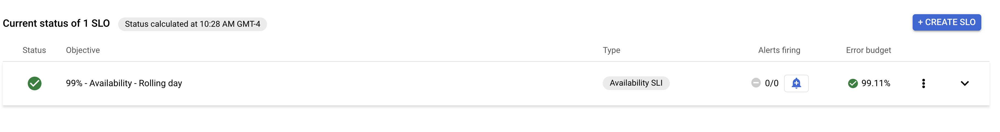

# Demo: Software Reliability with Anthos Service Mesh

## Prerequisites 

1. A GCP project with billing set up. 
2. [gcloud](https://cloud.google.com/sdk/docs/quickstarts) 
3. [kubectl](https://kubernetes.io/docs/tasks/tools/install-kubectl/)
4. [kpt](https://github.com/GoogleContainerTools/kpt)
5. [jq](https://stedolan.github.io/jq/)

## Setup 

1. Set the `PROJECT_ID` variable. 

```
export PROJECT_ID="<your-project-id>" 
```

2. Run the bootstrap script. Note - this script takes about 10 minutes to run.

```
./bootstrap.sh
```

This script does the following to set up an ASM environment: 
1. Creates a GKE cluster in your project (in zone=`us-central1-b`).
2. Installs ASM on your GKE cluster.
3. Enables ASM sidecar proxy injection for the default namespace. 
4. Sets up Workload Identity for the default GKE namespace, including giving the Workload Identity Google Service Account permissions to export application metrics and traces to Cloud Operations.  
5. Deploys the Bank of Anthos sample application to your cluster
6. Deploys an Istio VirtualService and Gateway for the app frontend, to allow for external ingress traffic.

When the script runs successfully, you should see: 

```
✅ Bootstrapping complete. Bank of Anthos frontend is available at:
EXTERNAL-IP
[your-external-ip]
```

If you navigate to that URL in a browser, you should see: 


## Part A - Exploring ASM's Generated Metrics

1. Open the Anthos Service Mesh dashboard in the Google Cloud Console by navigating to this link: https://console.cloud.google.com/anthos/services. Make sure the project ID at the top of the screen is set to your project.

2. The default view is the **Service List.** You should see all the Bank of Anthos services in the list, including a `frontend`, `loadgenerator`, several backends (eg. `contacts`, `balancereader`), and two in-cluster databases (`accounts-db`, `ledger-db`). You should also see metrics populated for all the services except the loadgen (which only produces traffic, does not receive traffic), and the two databases (ASM doesn't yet support raw TCP traffic). 


The metrics in this list are generated by the ASM sidecar proxy (Envoy) - you don't have to change your applications to get these metrics. In the next section we'll use these ASM-generated metrics to improve reliability of the app.

3. View the Service Topology by clicking on **Topology** at the top right of the screen. This is a view of the traffic between services. You should see loadgenerator traffic moving to the frontend, frontend traffic going to five backends, and traffic moving between two of the backends (ledgerwriter and balancereader). [If you go to the Bank of Anthos repo, and view the Architecture](https://github.com/GoogleCloudPlatform/bank-of-anthos#service-architecture), you'll see how the live service graph matches the architecture diagram. 


4. From the Topology, click on **ledgerwriter**. On the right, you should see the generated metrics for that service. Click **go to service dashboard.** 


5. Now we're in a service-specific view for the `ledgerwriter` backend. We can see inbound and outbound traffic, and change the Time Span of the metrics for that service. 


6. On the left sidebar, click **Metrics.** You should see not only the ASM-generated metrics in this view, but also pod metrics like Disk and CPU usage. This gives you an aggregate view of what's happening with this specific service over time. 


7. On the left sidebar, click **Infrastructure.** This is a view of the Kubernetes resources backing the ledgerwriter service. Here, we have just one Kubernetes Pod, spun up through a Deployment during bootstrapping. 


## Part B - Service-level Objectives with ASM 

The SRE Book [talks a lot about embracing risk](https://sre.google/sre-book/embracing-risk/) as a way to optimize for both cost and service availability. Ensuring 100% availability for a service can be very costly. Ensuring 99.99% availability to your users instead can reduce costs (fewer backup servers to maintain, for instance). But making that 99.99% availability guarantee requires you to measure what's happening inside your services at any given time.

[There are different ways to measure availability](https://sre.google/sre-book/service-level-objectives/). You can measure a service's uptime, request throughput (# of requests per second), request latency (how long requests take), or its request success rate (% of total requests that succeed without error). These different metrics are called Service-level Indicators (**SLIs**). 

Anthos Service Mesh automatically gathers these SLI metrics for each service - we saw this with the ledgerwriter service, in the Metrics view. Once we have these Service-level Indicators available to us, we can create **Service-level Objectives (SLOs)**. SLOs are like goals: it's a target threshold or range for one of these metrics. An example of an SLO might be, "I want ledgerwriter's latency request success rate to be 99.9%." Different types of services may set SLOs based on different SLIs - [the SRE book](https://sre.google/sre-book/service-level-objectives/) has more info on this.

Once you have service-level objectives, you can then **[Service-level agreements (SLAs)](https://sre.google/sre-book/service-level-objectives/)** between your software and its customers. An SLA is business contract that uses an SLO - it outlines "what happens?" if your software fails to meet its service-level objectives. 

Now that we know what SLOs are and how ASM generates the SLI metrics for us, let's set an SLO on the Bank of Anthos app. We'll set an SLO based on the latency of one of the backends, `transactionhistory`, stating that we need this service to respond within 10 milliseconds 99% of the time. 

1. Navigate back to the Service List and click on **transactionhistory.** Click **Create an SLO.** 


2. Set the SLI to **latency** and **request-based**. Click **Continue.** 


3. Set the latency threshold to **10ms**. Click **Continue**. 


4. Set the compliance period to **Rolling** - **1 day**. Set the Performance Goal to **99%**. Click **Continue**. 


5. Review and save your SLO - you can use the default title. Click **Create SLO.**  


6. You should be redirected to the Health page for the transactionhistory service, and you should see your new SLO in the list. It should be passing, with a green check-mark on the left side of the screen. 



7. Click the drop-down error in your SLO, and click **Error budget.** The [error budget of an SLO](https://cloud.google.com/stackdriver/docs/solutions/slo-monitoring#defn-error-budget) is 1 minus the SLO - so in our case, we have an error budget of **1%** because the SLO performance goal is **99%**. Because our SLO is based on latency, the error budget means that only 1% (or less) of requests in the last day can take longer than 10 milliseconds. 

## Part C - Setting up SLO Alerting 

With ASM, you can also set Alerting on your SLOs. Here, we'll set up an alert that goes to your email inbox. 

You can set up alerting using the [Console](https://cloud.google.com/stackdriver/docs/solutions/slo-monitoring/ui/create-alert) or the [command line](https://cloud.google.com/stackdriver/docs/solutions/slo-monitoring/api/create-policy-api) - we'll set up using the console. 

1. Navigate to the Cloud Monitoring - Alerting dashboard: https://console.cloud.google.com/monitoring/alerting. Click **Edit notification channels.** 

2. Next to "Email," click **Add New.** 

3. Type in the email address you use for your Google Cloud account. Set the display name to **My GCP Email.** Click **Save.** You should see your email in the Notification Channels list. 


4. Return to the ASM dashboard and navigate back to your transactionhistory Health dashboard: https://console.cloud.google.com/anthos/services/service/default/transactionhistory/health 


5. Next to your Latency SLO, click **Create SLO Alert.** 

ASM SLO alerting is based on something called **[burn rate](https://cloud.google.com/stackdriver/docs/solutions/slo-monitoring/alerting-on-budget-burn-rate)**, which is a measure of how fast you're consuming, or "burning," through your error budget. What this means is that you can set up an alert to fire even before your SLO fails. 

6. In the Create SLO Alert window, keep the default Display Name (`Burn rate on 99% - Latency - Rolling day`). Set `Lookback Duration` to **1 minute**. Keep the default `Burn rate threshold` (10). Click **Next.** 

7. Under "Who should be notified," click the drop-down menu, and choose **My GCP Email.** Note - you may have to click the refresh symbol to see your notification channel in the list. 


8. Click **Save** to create the SLO alert. Now on the right side of the Health view for transactionhistory, you should see `Alerts firing - 0/1`. 


## Part D - Debugging a Service with ASM 

Let's simulate a service outage in order to break our transactionhistory SLO and fire the alert to our email. To do this, we'll pretend that we're updating the transactionhistory service with some new configuration, and this causes an unexpected outage. 

1. Return to the terminal, and apply an updated transactionhistory deployment. (To simulate an outage scenario, this Deployment has 5 seconds of injected latency for every request.) 

```
kubectl apply -f simulate-outage/transactionhistory.yaml
```

Expected output: 

```
deployment.apps/transactionhistory configured
service/transactionhistory unchanged
```

2. Wait for the new transactionhistory pod to be ready, and for the old pod to terminate.  

```
kubectl get pods | grep transactionhistory
```

Expected output (after 1-2 minutes): 

```
transactionhistory-68bb6559b4-b9n2v   2/2     Terminating   0          74m
transactionhistory-6b699f4b96-gdqnv   2/2     Running       0          72s
```

3. Navigate back to the ASM dashboard for the transactionhistory service, and in the left sidebar, click **Metrics.** Scroll down to **Latency.** We should be able to watch the generated metrics flow in, and we should see a major latency spike, from ~5 milliseconds on average per request, up to 4 or 5 seconds. 


Under the hood, the ASM SLO is rapidly burning through its error budget for the number of transactionhistory requests that can exceed the 10 millisecond threshold. (Because 100% of requests, now, exceed that SLO threshold.) This means we just caused transactionhistory to exceed its burn rate threshold of 10%. 

4. `TODO - see email notification for alert`

Let's pretend that we don't know what's causing this latency in transactionhistory - in a real outage scenario, it's unlikely that you'll know right away what caused the issue. ASM and Google Cloud provide several tools to help you debug during service degradation. 

5. From the transactionhistory view in the ASM dashboard, click **Diagnostics.** Here, we can see all recent error logs for this service. 


We can also click "Open Logs Viewer" to see Info, Warning, and Debug-level logs for this service. 


We can also view Traces for the transactionhistory service. Traces allow us to see how long each part of a request takes. This feature is especially helpful in a microservices setup, where "cascading failures" cause problems in 1 service to propagate to other upstream services. Anthos Service Mesh supports "service level traces" (meaning you can see traces down to the service-level). You can use OpenTelemetry or OpenCensus to instrument your services to allow for more granular, request-level traces within each service (for instance, how long a specific function spent on a given request). The Bank of Anthos dashboard has been instrumented for request-level traces. 

6. Navigate to the Cloud Trace dashboard: https://console.cloud.google.com/traces/list. Click on **Trace list.** 


You should see most requests only take a few milliseconds, but you should also see a few recent outliers taking ~5 seconds. 

7. Click on one of those outlier traces - it should correspond to a request involving the transaction history service. (So if we didn't know which service update caused the SLO failure, now we have an idea that transactionhistory is involved.) If you scroll down, you should see details about this trace - for instance, the method  (`getTransactions`) and specific URL. 


## Learn More 

- [Cloud Operations Docs - Concepts in Service Monitoring](https://cloud.google.com/stackdriver/docs/solutions/slo-monitoring)
- [The SRE Book from Google](https://sre.google/sre-book/table-of-contents/)
- [ASM Docs - Explore ASM in the Cloud Console](https://cloud.google.com/service-mesh/docs/observability/explore-dashboard)
- [ASM Docs - Creating an SLO from the Command Line](https://cloud.google.com/stackdriver/docs/solutions/slo-monitoring/api/using-api#slo-create)
- [ASM Docs - Creating an Alerting Policy](https://cloud.google.com/stackdriver/docs/solutions/slo-monitoring/ui/create-alert)